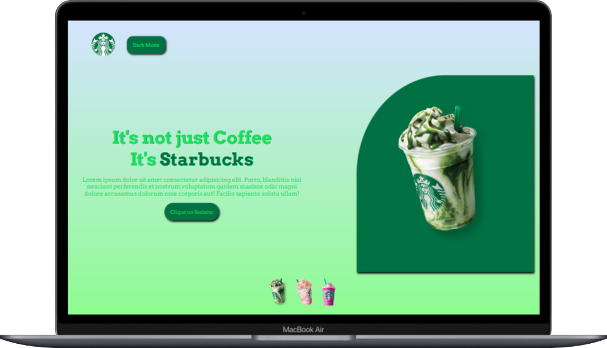
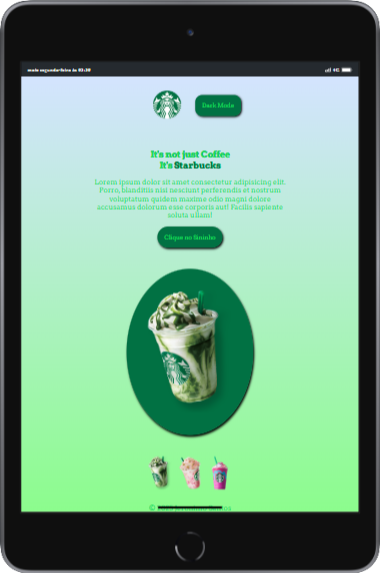
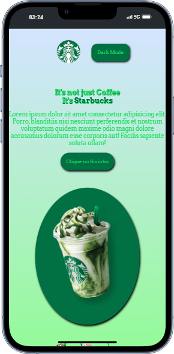

# Projeto DEVCLUB - StarBucks

Projeto desenvolvido durante evento devclub, onde foram apresentados conseitos e tecnologias que as empresas usam. Nesse prejeto foi desenvolvido um site modelo da empresa starbucks para praticar as tecnologias: Html, Css e Javascript.

Também foi ensinado boas práticas no Linkedin, Curriculo e colocar o site no ar.

## Tecnologias Utilizadas
- HTML
- CSS
- JAVASCRIPT
- GIT

## Responsividade

### Tamanho Monitor

### Tamanho Tablet

### Tamanho Mobile

